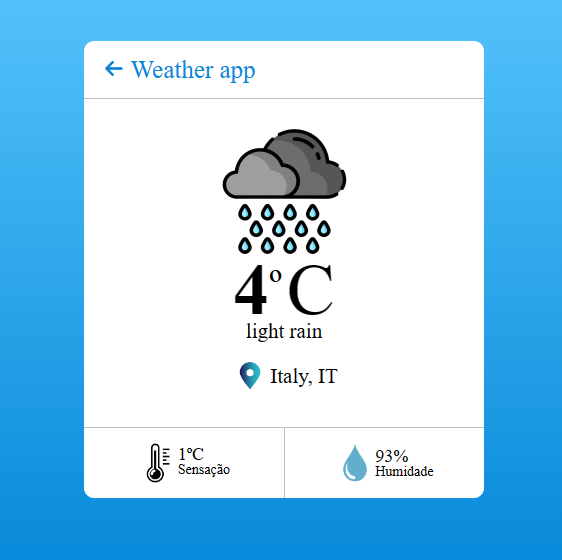
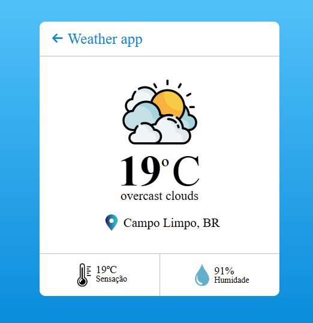
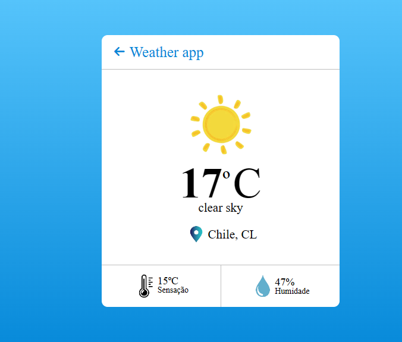

<h1 align="center"> Weather app</h1>

  
  

`Objetivo do projeto:` Testar a minha capacidade de usar pela primeira vez uma API e juntamente conseguir conciliar com o tanto que estou aprendendo com os meus projetos usando JavaScript. 

 
 
 

<h3 align="center">👩🏽‍💻 Tecnologias Utilizadas</h3>   

* HTML;
* CSS;
* JavaScript.
